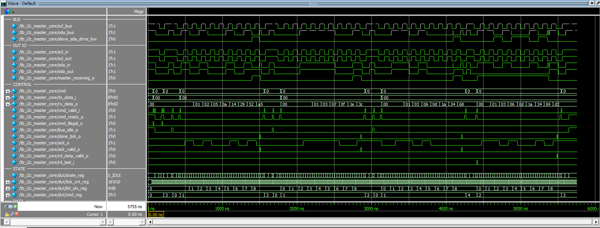
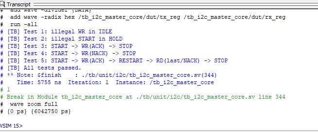

# ENG NOTEBOOK - I2C Custom Core Bring-Up

**Project:** fpga-modular-control-system  
**Date:** 2026-04-16  
**Workstream:** I2C / MPU-6500 bring-up foundation  
**Stage:** Custom byte-engine verification complete; wrapper integration next

---

## 1. Objective

Develop and verify a project-owned I2C master byte engine that is easier to inspect, modify, and integrate than the earlier vendor/IP-centered path, while preserving the repository’s modular peripheral philosophy.

Near-term hardware target:
- MPU-6500 on the self-balancing kit

Immediate milestone:
- complete protocol-level simulation of the custom core before building the software-visible register/MMIO layer

---

## 2. Background and Design Pivot

This workstream changed direction.

The earlier plan centered on integrating a third-party or vendor-origin I2C solution, then wrapping it with project-owned register and AXI4-Lite logic. That approach no longer reflects the current implementation branch.

The active branch now uses a **project-owned custom I2C master core** written specifically for this repository.

### Why the direction changed
The custom-core route provides several practical advantages for this phase of the project:

- simpler waveform-level inspection
- easier protocol debugging during bring-up
- cleaner ownership of the software-visible contract
- easier explanation in an FPGA/embedded portfolio context
- fewer integration unknowns while validating bus behavior

This change does **not** mean the previous exploration was wasted. The earlier work helped validate the board-level open-drain path and reduced uncertainty around the external electrical interface.

---

## 3. Current Design Summary

The current RTL block is a **byte-oriented, single-master I2C engine**.

Current file focus:
- `rtl/peripherals/i2c/core/i2c_master_core.sv`

Current verification focus:
- `tb/unit/i2c/tb_i2c_master_core.sv`

### Implemented command set
The custom core currently supports the following byte-engine commands:

- `START`
- `WR`
- `RD`
- `STOP`
- `RESTART`

This is intentionally a **protocol engine**, not yet a complete MMIO-visible peripheral.

### Current command interface
The core uses an explicit command handshake:

- `cmd`
- `cmd_valid_i`
- `cmd_ready_o`

Accepted command rules:
- `S_IDLE` accepts only `START_CMD`
- `S_HOLD` accepts:
  - `WR_CMD`
  - `RD_CMD`
  - `STOP_CMD`
  - `RESTART_CMD`

### Current status/result outputs
The core exposes:

- `done_tick_o`
- `ack_o`
- `ack_valid_o`
- `rd_data_valid_o`
- `bus_idle_o`
- `master_receiving_o`
- `cmd_illegal_o`

These signals were added to make later wrapper integration cleaner and to remove ambiguity during simulation.

---

## 4. Open-Drain Integration Convention

The design continues to use the already-debugged open-drain top-level convention.

Conceptually:

```systemverilog
assign GPIO[PIN_MPU_I2C_SCL] = scl_drive_low ? 1'b0 : 1'bz;
assign GPIO[PIN_MPU_I2C_SDA] = sda_drive_low ? 1'b0 : 1'bz;

assign scl_i = GPIO[PIN_MPU_I2C_SCL];
assign sda_i = GPIO[PIN_MPU_I2C_SDA];
```

For the custom core, the wrapper-side SDA behavior is intentionally explicit:

```systemverilog
assign sda = (master_receiving_o || sda_out) ? 1'bz : 1'b0;
assign scl = (scl_out) ? 1'bz : 1'b0;
```

### Interpretation
- `sda_out = 0` -> master drives SDA low
- `sda_out = 1` -> master releases SDA
- `scl_out = 0` -> master drives SCL low
- `scl_out = 1` -> master releases SCL
- `master_receiving_o = 1` -> wrapper must release SDA because the slave owns that phase

This keeps bus ownership clear during both read and write transactions.

---

## 5. Divider / Timing Behavior

The current core clamps the requested divider to a minimum safe value and latches the transaction timing at the start of a new transaction.

Current design intent:
- divider is captured at `START_CMD`
- the entire transaction uses that latched divider
- mid-transaction software changes do not alter bus timing unexpectedly

This is a deliberate choice to keep protocol timing stable.

### Current limitation
Clock stretching is **not** implemented yet.
`scl_in` is reserved for that future extension.

---

## 6. Verification Strategy

A self-checking unit testbench was written to validate the protocol engine before any MMIO or AXI4-Lite wrapper work.

The testbench models:
- open-drain SDA/SCL behavior
- pull-up / released-bus behavior through tri-state resolution
- a simple slave that can:
  - ACK or NACK write transactions
  - source read data bits onto SDA
- legal and illegal command launches

This provides a focused protocol-level verification stage before system integration.

---

## 7. Verification Results

### Passing self-checking tests
The current simulation pass covers the following scenarios:

1. illegal `WR_CMD` in `S_IDLE`
2. illegal `START_CMD` in `S_HOLD`
3. `START -> WR(ACK) -> STOP`
4. `START -> WR(NACK) -> STOP`
5. `START -> WR(ACK) -> RESTART -> RD(last/NACK) -> STOP`

Result:
- **all tests passed**

### Waveform evidence
```markdown

```

Repo path:
- `docs/notebook/img/2026-04-16-tb_i2c_coreV1_wave.png`

### Transcript / pass evidence
```markdown

```

Repo path:
- `docs/notebook/img/2026-04-16-tb_i2c_coreV1_pass.png`


The I2C workstream has now moved from a vendor-core integration plan to a custom project-owned byte-engine implementation.

Current status:
- custom core implemented
- open-drain convention preserved
- self-checking simulation completed
- representative command sequences verified
- ready for wrapper/register integration
