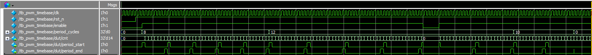
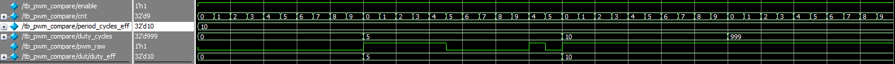

# Engineering Lab Notebook - PWM Subsystem (DE10-Lite, 50MHz)

**Owner:** Eder Torres
**Repo:** https://github.com/eftorres-embedded/fpga-modular-control-system
**Clock:** 50 MHz (DE10-Lite)
**Scope:** pwm_timebase, pwm_compare, pwm_core, later regs + modes + adpaters

---

## 01-29-2026 - PWM Core Bring-up (timebase + compare)

### Objective
- Implement portable PWM core:
    -   `pwm_timebase.sv` (up-counter + period_end-pulse + period_start_pulse)
    -   `pwm_compare.sv` (cnt<duty)
    -   `pwm_core.sv` wrapper (defaults + clamping policy)
- Create minimal testbench  `tb_pwm_core.sv`:
  1) verify `period_end` spacing
  2) verify duty counts (0%, 50%, 100%)

  ### Requirements / Constraints
  - `clk = 50_000_000` Hz
  - Start with `f_pwm = 10` KHz => `period_cycles = 5000` (one PWM period must last 5,000 clock cycles)
  - Duty must support true 0% and 100%
  - Clamp `period_cycles < 2` to 2: this is to avoid edgecases such `period_cycles == 0`, when comparing, the comparison might become  `period_cycles - 1` which will return `0xFFFF...FF`. Or, if `period_cycles == 1`, when comparing the `cnt`, it will be something like if (`cnt < duty` becomes meaningless, `period_end` will fire every cycle.
  - Clamp `duty_cycles > period_cycles` to period

  ### Design Decisions
  | Decision | Choice | Rationale |
  |---|---:|---|
  | Counter width | 32 bits | Cheap, avoids future limits |
  | Disable bahvior | force `cnt=0`, `pwm_raw=0` | Safe for motors; deterministic|
  | Period update | immedate (core); boundary-sync later | Keep core portable; Apply hande in regs layer |

  ---

  ### 02-04-2026 — Architectural Rationale (PWM Core)

  During waveform inspection and unit-test verification of the PWM timebase and compare blocks, the following architectural rationale was documented to capture the reasoning behind the design choices.

  #### Why the PWM timebase and compare logic are split

  The PWM implementation is intentionally divided into two core blocks:

  - `pwm_timebase`: generates a shared counter (`cnt`) and period framing
  - `pwm_compare`: generates a raw PWM signal by comparing `cnt` against a duty threshold

  A single timebase can be shared by multiple PWM channels (multiple DC motors, RGB LEDs, or 3-phase motor control), avoiding duplication of counters. Counters are relatively expensive in hardware, while comparators are cheap, making this structure both scalable and resource-efficient.

  The split also improves testability. The timebase can be unit-tested independently for correct counting, wrapping, and pulse generation, while the compare block can be tested independently for duty behavior (0% 50%, 100%, and saturation). This reduces ambiguity during debugging.

  Finally, this separation enables mode flexibility. Different output modes (sign/magnitude, complementary, servo pulses, etc.) can all consume the same `pwm_raw` signal without modifying the core timing logic.

  ---

## Procedure
- [x] add RTL files:
  -`rtl/peripherals/pwm/pwm_timebase.sv`
  -`rtl/perifpherals/pwm/pwm_compare.sv`
  -`rtl/peripherals/pwm/pwm_core_ip.sv`

- [x] Add testbench:
  - `tb/unit/pwm/tb_pwm_core_ip.sv`
  - `tb/unit/pwm/tb_pwm_compare.sv`
  - `tb/unit/pwm/tb_pwm_timebase.sv`

- [ ] Write the code:
  - [x] `pwm_timebase.sv`
  - [x] `pwm_compare.sv`
  - [ ] `pwm_core_ip.sv`

- [ ] Write the testbench:
  - [ ] `tb_pwm_core_ip.sv`
  - [x] `tb_pwm_timebase.sv`
  - [x] `tb_pwm_compare.sv`

- [ ] Run simulation (Questa Altera)
  - [x] Create work library under `build/sim/work`
  - [x] Compile RTL + TB for tb_pwm_timebase
  - [x] Create waveform for tb_pwm_timebase
  
  - [x] Create work library under `build/sim/work`
  - [x] Create waveform for tb_pwm_compare
  - [ ] Compile RTL + TB for tb_pwm_core

  - [ ] Run TB in command-line mode
  - [ ] Save transcript to `build/sim/logs/tb_pwm_core_ip.txt`
  - [ ] Dump waveform to `build/simwaves/tb_pwm_core_ip.wlf`

- [ ] Open waveform:
  - [ ] Inspect `cnt`, `period_end`, `period_cycles`, `duty_cycles`, `pwm_raw`
  - [ ] Screenshot: `docs/notebook/img/date_pwm_core10khz_50pct.png`

### Test Plan (core)
- [ ] T1 Reset: `cnt=0`, `pwm_raw=0`
- [ ] T2 Period: `period_end` every 5000 cycles
- [ ] T3 Duty extremes:
  - [ ] `duty=0` always low
  - [ ] `duty=2500` exactly 2500 high per period
  - [ ] `duty=5000` always high
- [ ] T4 Saturation: `duty=6000` behaves like 100%

### Results
| Test | Expected | Observed | Pass/Fail | Notes|
|---|---|---|---| ---|
| T1 | - | - | - | - |
| T2 | - | - | - | - |
| T3a | - | - | - | - |
| T3b | - | - | - | - |
| T3c | - | - | - | - |

### Evidence (waveforms / screenshots)
- Waveform capture: `docs/notebook/img/file.png`
- VCD file: `sim/out/tb_pwm_cre.vcd`

---

### Issues / Debug Notes
- 2/2/2026: tb_pwm_timebase Test #4 was erroring out, issue was with testbench, `fixed`.

### Next Steps
- [ ] Add randomized test for (period, duty) pairs
- [ ] Decide if `period_start` is need by higher layers
- [ ] Start `pwm_regs.sv` with shadow+APPLY

### PWM Timebase - 10-cycle period


- `period_end` asserts once every 10 clocks
- `cnt` wraps to 0 on the same edge

### 2/6/2026 - Writing the unit testbench for pwm_compare I will be looking for the following
- pwm_compare is combinational
- I will manually drive cnt so I don't have to instantiate the timebase
- The clock is not required but I will use one to step cleanly
- For a given period P and duty D:
  - **D = 0** → pwm always 0  
  - **D = P/2** → pwm high for exactly D counts (50% duty)  
  - **D = P** → pwm always 1  
  - **D > P** → saturates to P (pwm always 1)  
  - **enable = 0** → pwm always 0  

### 2/10/2026 - These are the results for the unit testbench for pwm_compare
## PWM Compare - Period 10: duty = 0, 5, 10, 999


- PWM output clamps to high at `duty = 999`

### Next I will be creating a wapper for pwm_timebase and pwm_compare as bellow:
```text
              +------------------+
period_cycles |                  |
enable ------>|  pwm_timebase    |--> cnt
clk ----------|                  |--> period_end
rst_n --------|                  |
              +------------------+
                        |
                        v
              +------------------+
duty_cycles ->|   pwm_compare    |--> pwm_raw
enable ------>|                  |
cnt ----------|                  |
              +------------------+

                       |
                       v
                  pwm_out
```
### For this integration test I will check:
- Does the counter run?
- Does pwm_out toggle correctly?
- Does it match 50% duty?
- Does disable force low?
- Does reset clear it?

### Note: 
- For this integration test, `.period_cycles_eff(period_cycles)` will be okay, it might get revised later. 
- We will not implement shadow registers yet