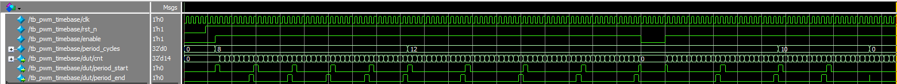
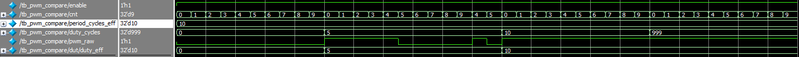
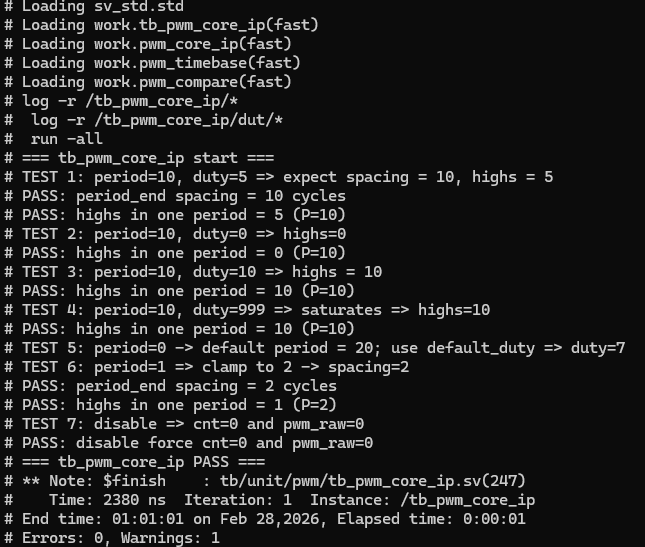
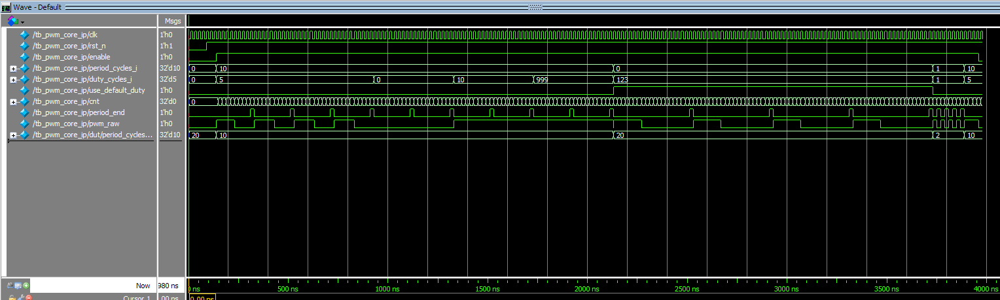

# Engineering Lab Notebook - PWM Subsystem (DE10-Lite, 50MHz)

**Owner:** Eder Torres
**Repo:** https://github.com/eftorres-embedded/fpga-modular-control-system
**Clock:** 50 MHz (DE10-Lite)
**Scope:** pwm_timebase, pwm_compare, pwm_core, later regs + modes + adpaters

---

## 01-29-2026 - PWM Core Bring-up (timebase + compare)

### Objective
- Implement portable PWM core:
    -   `pwm_timebase.sv` (up-counter + period_end-pulse + period_start_pulse)
    -   `pwm_compare.sv` (cnt<duty)
    -   `pwm_core.sv` wrapper (defaults + clamping policy)
- Create minimal testbench  `tb_pwm_core.sv`:
  1) verify `period_end` spacing
  2) verify duty counts (0%, 50%, 100%)

  ### Requirements / Constraints
  - `clk = 50_000_000` Hz
  - Start with `f_pwm = 10` KHz => `period_cycles = 5000` (one PWM period must last 5,000 clock cycles)
  - Duty must support true 0% and 100%
  - Clamp `period_cycles < 2` to 2: this is to avoid edgecases such `period_cycles == 0`, when comparing, the comparison might become  `period_cycles - 1` which will return `0xFFFF...FF`. Or, if `period_cycles == 1`, when comparing the `cnt`, it will be something like if (`cnt < duty` becomes meaningless, `period_end` will fire every cycle.
  - Clamp `duty_cycles > period_cycles` to period

  ### Design Decisions
  | Decision | Choice | Rationale |
  |---|---:|---|
  | Counter width | 32 bits | Cheap, avoids future limits |
  | Disable bahvior | force `cnt=0`, `pwm_raw=0` | Safe for motors; deterministic|
  | Period update | immedate (core); boundary-sync later | Keep core portable; Apply hande in regs layer |

  ---

  ### 02-04-2026 — Architectural Rationale (PWM Core)

  During waveform inspection and unit-test verification of the PWM timebase and compare blocks, the following architectural rationale was documented to capture the reasoning behind the design choices.

  #### Why the PWM timebase and compare logic are split

  The PWM implementation is intentionally divided into two core blocks:

  - `pwm_timebase`: generates a shared counter (`cnt`) and period framing
  - `pwm_compare`: generates a raw PWM signal by comparing `cnt` against a duty threshold

  A single timebase can be shared by multiple PWM channels (multiple DC motors, RGB LEDs, or 3-phase motor control), avoiding duplication of counters. Counters are relatively expensive in hardware, while comparators are cheap, making this structure both scalable and resource-efficient.

  The split also improves testability. The timebase can be unit-tested independently for correct counting, wrapping, and pulse generation, while the compare block can be tested independently for duty behavior (0% 50%, 100%, and saturation). This reduces ambiguity during debugging.

  Finally, this separation enables mode flexibility. Different output modes (sign/magnitude, complementary, servo pulses, etc.) can all consume the same `pwm_raw` signal without modifying the core timing logic.

  ---

## Procedure
- [x] add RTL files:
  - [x] `rtl/peripherals/pwm/pwm_timebase.sv`
  - [x] `rtl/perifpherals/pwm/pwm_compare.sv`
  - [x] `rtl/peripherals/pwm/pwm_core_ip.sv`

- [x] Add testbench:
  - [x] `tb/unit/pwm/tb_pwm_core_ip.sv`
  - [x] `tb/unit/pwm/tb_pwm_compare.sv`
  - [x] `tb/unit/pwm/tb_pwm_timebase.sv`

- [x] Write the code:
  - [x] `pwm_timebase.sv`
  - [x] `pwm_compare.sv`
  - [x] `pwm_core_ip.sv`

- [x] Write the testbench:
  - [x] `tb_pwm_core_ip.sv`
  - [x] `tb_pwm_timebase.sv`
  - [x] `tb_pwm_compare.sv`

- [x] Run simulation (Questa Altera)
  - [x] Create work library under `build/sim/work`
  - [x] Compile RTL + TB for tb_pwm_timebase
  - [x] Create waveform for tb_pwm_timebase
  
  - [x] Create work library under `build/sim/work`
  - [x] Create waveform for tb_pwm_compare
  - [x] Compile RTL + TB for tb_pwm_core

  - [x] Run TB in command-line mode
  - [x] Save transcript to `build/sim/logs/tb_pwm_core_ip.txt`
  - [x] Dump waveform to `build/simwaves/tb_pwm_core_ip.wlf`

- [x] Open waveform:
  - [x] Inspect `cnt`, `period_end`, `period_cycles`, `duty_cycles`, `pwm_raw`
  - [x] Screenshot: `docs/notebook/img/2026-03-01 - tb_pwm_core_ip - waveform`


### Test Plan (core) Period = 10 unless stated otherwise (test done on Feb. 28, 2026)
- [x] T1 `duty=5` exactly 5 high per period
- [x] T2 `duty=0` always low
- [x] T3 `duty=10` always high
- [x] T4 Saturation: `duty=999` behaves like 100%
- [x] T5 Default Period & Default duty Cycle:
- [x] T6 Timebase clamps to 2: when `period=1`
- [x] T7 Disable behavior: `pwm_raw is 0` 

### Results
| Test | Expected | Observed | Pass/Fail | Notes|
|---|---|---|---| ---|
| T1 | duty = 5 | duty% = 50% | Pass | used period cycles = 10 |
| T2 | duty = 0 | duty% = 0% | Pass | pure "off" test |
| T3 | duty = 10 | duty% = 100% | Pass | used period cycles = 10 |
| T4 | duty = 999| duty% = 100% | Pass | Saturation test |
| T5 | duty = 7, period = 20 | duty = 7, period = 20| Pass | period = 0 (enable default period), use_default_duty = 1, requested this: duty = 123, period = 0 |
| T6 | period = 2 | period = 2 | Pass | period was set to 1, as safenet, it should be always greater than 1, so 2 by default |
| T7 | duty = 0 | duty% = 0 | Pass | pwm shuts down when disabled |

### Evidence (waveforms / screenshots) (March 1, 2026)
- Waveform capture: `docs/notebook/img/22026-03-01-tb_pwm_core_ip-waveform.png`

---

### Issues / Debug Notes
- 2/2/2026: tb_pwm_timebase Test #4 was erroring out, issue was with testbench, `fixed`.

### Next Steps
- [ ] Add randomized test for (period, duty) pairs
- [ ] Decide if `period_start` is need by higher layers
- [ ] Start `pwm_regs.sv` with shadow+APPLY

### PWM Timebase - 10-cycle period


- `period_end` asserts once every 10 clocks
- `cnt` wraps to 0 on the same edge

### 2/6/2026 - Writing the unit testbench for pwm_compare I will be looking for the following:
### PWM Compare – Formal Definition

Let:

- `duty_eff = min(duty_cycles, period_cycles_eff)`
- `pwm_raw = enable ∧ (cnt < duty_eff)`

Then over one PWM period:

| Parameter Relationship | High Counts | Low Counts | Notes |
|------------------------|------------|-----------|-------|
| `enable = 0` | 0 | `period_cycles_eff` | Forced low |
| `duty_cycles = 0` | 0 | `period_cycles_eff` | 0% duty |
| `0 < duty_cycles < P` | `duty_cycles` | `P - duty_cycles` | Normal PWM |
| `duty_cycles = P` | `P` | 0 | 100% duty |
| `duty_cycles > P` | `P` | 0 | Saturates to 100% |

Where `P = period_cycles_eff`.

### 2/10/2026 - These are the results for the unit testbench for pwm_compare
## PWM Compare - Period 10: duty = 0, 5, 10, 999


- PWM output clamps to high at `duty = 999`

### Next I will be creating a wapper for pwm_timebase and pwm_compare as bellow:
```text
              +------------------+
period_cycles |                  |
enable ------>|  pwm_timebase    |--> cnt
clk ----------|                  |--> period_end
rst_n --------|                  |
              +------------------+
                        |
                        v
              +------------------+
duty_cycles ->|   pwm_compare    |--> pwm_raw
enable ------>|                  |
cnt ----------|                  |
              +------------------+

                       |
                       v
                  pwm_out
```
### For this integration test I will check:
- Does the counter run?
- Does pwm_out toggle correctly?
- Does it match 50% duty?
- Does disable force low?
- Does reset clear it?

### Note: 
- For this integration test, `.period_cycles_eff(period_cycles)` will be okay, it might get revised later. 
- We will not implement shadow registers yet

### 02/14/2026 - Update to pwm_core_ip
* added `period_cycles_eff` output to `pwm_timebase` so downstream coompare uses the clamped effective period
* Updated `pwm_core_ip` to feed compare with `period_cycles_eff` to eliminate illegal-period mismatch
* Added explicit casts `CNT_WIDTH'(DEFAULT_*) for width safety
* Next: write ` tb_pwm_core_ip` integration testbench + wave capture

### 02/16/2026 - Implement testbench for pwm_core_ip
* This testbech will override the DUT defaults with small number so the waveforms are readable and the simulation finishes fast


### February 28, 2026 - Run simulation for the tb_pwm_core_ip
* Added test to check several expected features of the pwm module
  * Normal 50% duty cycle
  * 0% duty cycle
  * 100% duty cycle
  * saturation (duty cycle > than period). Duty Cycle get clamped
  * If period is set to 0, the period will be set to default and if use_default_duty is 1'b1, use the default duty cycle
  * Clamp period to 2 if, set period is set to less than 2
  * If RS_CNT_WHEN_DISABLED == 1, pwm should be low immediately

## All simulation Tests passed





## March 1, 2026: Core PWM Hardware block is completed. In the next section I will a register block wrapper (MMIO to later adapt to differnt buses such as AXI or Avalon)
### The modules to be added are:
  * `pwm_regs.sv` - Register file + shadow/apply
  * `pwm_mmio.sv` - Generic Memory Mapped IO "request/response" port
### I will start with the following register for now:
| Offset | Name | Bits | Description | Notes|
|---|---|---|---| ---|
| 0x00 | CTRL | [0] = enable, [1] = use_default_duty, [2] = apply | `apply` copies shawdow => active | `apply` bit auto-cleared by hardware |
| 0x04 | PERIOD | 32 | shadow period_cycles | - |
| 0x08 | DUTY | 32 | shadow duty_cycles | - |
| 0x0C | STATUS | [0] = period_end (sticky optional) | readback/debug | - |
| 0x10 | CNT | 32 | live counter readback | - |

### `pwm_regs.sv` should have the following generic MMIO interface:
  * wr_en, wr_addr, wr_data, wr_strb
  * rd_en, rd_addr, rd_data
  * ready and valid

### Testbench should:
  * Write period/duty
  * assert apply
  * check that the core sees changes only after `apply`

## March 17, 2026: Started the MMIO wrapper file. 
### For hardware simplification there will be a Software contract:
  * 1. Write `REG_PERIOD`
  * 2. Write `REG_DUTY`
  * 3. Write `REG_CTRL` bits `[1:0]` if needed
  * 4. Write `REG_CTRL` with only `APPLY` bit set (bit 2) : UPDATED!! on MARCH 25th

### For code simplicity, `PERIOD` and `DUTY` should be 32-bits for the transfer to work correctly
due to how the `WORD` modification was implemented; it is byte addreseably and at the moment
the logic is expecting 4-bytes. If the parameter sizes change from the default 32, 
bits might get truncated .
From my research, the recommended code should be this one:
```systemverilog
  // ----------------------------
  // Helpers: byte-write merge for 32-bit regs
  // ----------------------------
  function automatic logic [DATA_W-1:0] merge_wstrb(
    input logic [DATA_W-1:0] old_val,
    input logic [DATA_W-1:0] new_val,
    input logic [(DATA_W/8)-1:0] strb
  );
    logic [DATA_W-1:0] out;
    int b;
    begin
      out = old_val;
      for (b = 0; b < (DATA_W/8); b++) begin
        if (strb[b]) out[b*8 +: 8] = new_val[b*8 +: 8];
      end
      return out;
    end
  endfunction
  ```

A simple copy-paste should work, but I will do once I make sure the 32-bit version is fully working
Also, other modification might be needed when assigning values to th e shadow registers (ctrl_merge, etc)
by specifiying the bit length vector (e.g. `period_shadow   <=  merge_wstrb(period_shadow, req_wdata, req_wstrb)` to `period_shadow   <=  merge_wstrb(period_shadow, req_wdata[CNT_W-1:0], req_wstrb)`)

## March 18,2026: before fine tunning and create a test bench for MMIO wrapper file (pwm_subsystem.sv), I decided to do a "smoke test" and do a quick integration with NIOS V
### For that I could use either AVALON or AXI Buses, I'm deciding to use AXI4 Lite for portability
Before I instantiate the system into a NIOS V processor, I will create an adapter for my MMIO wrapper into AXI4 Lite

## March 23, 2026: I have finished an AXI 4 lite slave wrapper for the PWM MMO
Before creating a test bench I decided to do smoke test to see any obvious issues
## March 24, 2026: I have created a new project where I was able to instantiate a NIOS V/m core, using internal memory. 
I created system using Platform designer it includes:
* clk: contains a clock in and clk_reset output (required for all subsystems)
* niosv_m: RISC V core, speciallized for microcontrollers
* onchip_memory: I'm using the MAX10 memory blocks to store code
* jtag_uart: I'm using a jtag through usb to program and talk to console through fprints
* axi_lite_pwm: This block was created by be, is a component that uses AXI 4 lite Slave, this block wraps the registers MMIO wrapper(pwm_subsystem), which itself wraps which wraps pwm_core_ip, which instantiates pwm_compare and pwm_timebase. 

I also setup the Altera toolchain, Ashling, for C code compilation, and used the Nios V Command shell to build the BSP, compile the C code and program the soft-core.

To check quickly if it worked, I connected the PWM_out conduit to an LED to see if I could see it blinking (by setting up the period to be .5 sec and a duty cycle of 50%).

It didn't work at the beginning, after a little research I came to the conclusion is that there was deadlock situation: One of the parameters, APPLY_ON_PERIOD_END, was enabled, meaning that no changes in period and duty cycle would be updated (APPLY) to the main registers until the end of the current period, but, the current period cannot start if it's not already setup creating a "catch 22" situation. 

To test this theory, the parameter was disable, and now writing to the APPLY bit do go through and the LED started behaving as expected. 

I will be adding a little bit of logic to allow for APPLY if PWM is not enabled yet.

## March 25, 2026: the logic has been added and will be tested with the following settings
## All simulation Tests passed


Major revision for pwm_reg.sv were done; there were too many corner cases by having the `APPLY` bit on the same register as `enable` and `default_duty` in the `CTRL_REG`.
I decided to separate `APPLY` to its own register.
`CTRL_REG` now writes directly to a shawdow register and it works exactly as the other registers such as `DUTY_REG`. The software contract is now much more cleaner. 

### For hardware simplification there will be a Software contract:
  * 1. Write `REG_PERIOD`
  * 2. Write `REG_DUTY`
  * 3. Write `REG_CTRL` bits `[1:0]` if needed
  * 4. Write `REG_APPLY` with 1 in bit 0 

# PWM Subsystem V2 Transition Notes

**Project:** FPGA Modular Control System  
**Board:** DE10-Lite  
**Clock Assumption:** 50 MHz  
**Scope:** Transition from single-channel PWM subsystem (V1) to scalable multi-channel PWM subsystem (V2)

---

# 1. Purpose of V2

PWM Subsystem V2 is an **incremental extension** of the existing PWM design.
The architectural style, module roles, and register programming model remain aligned with V1.

The main reason for V2 is to scale the design from **one PWM output** to **N PWM outputs** while keeping:

- a **shared PWM frequency** across all channels
- a **single shared timebase/counter**
- **independent duty control per channel**
- the same **shadow/active + APPLY** update philosophy
- the same bus-agnostic MMIO style already used in the current design

V2 is intended to be the new baseline for future motor-control features.

---

# 2. High-Level Architectural Direction

V1 architecture:

```text
                 +------------------+
period_cycles -->|   pwm_timebase   |--> cnt
enable --------->|                  |--> period_end
clk/rst -------->|                  |
                 +------------------+
                           |
                           v
                    +-------------+
duty_cycles ------->| pwm_compare |
enable, cnt ------->|             |
                    +-------------+
                           |
                        pwm_raw
```

V2 architecture:

```text
                 +----------------------+
period_cycles -->|     pwm_timebase     |--> cnt
enable --------->|                      |--> period_end
clk/rst -------->|                      |
                 +----------------------+
                              |
                              v
                 +----------------------------------+
                 |  per-channel compare generation  |
                 |                                  |
                 |  ch0: cnt < duty[0] --> pwm[0]  |
                 |  ch1: cnt < duty[1] --> pwm[1]  |
                 |  ch2: cnt < duty[2] --> pwm[2]  |
                 |  ...                             |
                 |  chN: cnt < duty[N] --> pwm[N]  |
                 +----------------------------------+
```

The key idea is unchanged: **one shared counter, many compare paths**.
Only the compare/output side is being scaled.

---

# 3. What Stays the Same in V2

The following design decisions from V1 remain valid and should remain in place:

## 3.1 Shared timebase philosophy
- One counter drives all PWM channels.
- All PWM outputs in the module run at the same period/frequency.
- Period clamping behavior remains in hardware.

## 3.2 Compare-based PWM generation
- Each output channel is still generated by a simple compare:
  - `pwm[i] = enable && (cnt < duty[i])`
- Duty saturation behavior remains in hardware.

## 3.3 Register programming model
- Shadow registers remain software-visible configuration storage.
- Active registers remain the hardware-consumed configuration set.
- `REG_APPLY` remains the synchronization point between shadow and active state.

## 3.4 Optional boundary-synchronized update model
- `APPLY_ON_PERIOD_END` remains a parameter.
- Immediate apply vs period-boundary apply remains part of the subsystem behavior.

## 3.5 Bus style and wrapper style
- The subsystem remains bus-agnostic internally.
- Generic MMIO request/response channel style remains the same.
- AXI4-Lite remains an adapter/wrapper.

## 3.6 Safety-oriented reset behavior
- Reset should still force PWM outputs low.
- Reset should still clear control state, period state, and duty state.
- Disabled behavior should remain deterministic and safe.

---

# 4. What Is Removed from V1

V2 removes or retires the following V1 assumptions/features.

## 4.1 Single-output assumption
V1 exported one PWM output:

```text
pwm_raw
```

V2 replaces this with a vector of PWM outputs:

```text
pwm_out[CHANNELS-1:0]
```

## 4.2 Single-duty assumption
V1 had one duty register and one duty path.

```text
REG_DUTY
```

V2 replaces this with a bank of per-channel duty registers.

```text
REG_DUTY[i] at 0x20 + 4*i
```

## 4.3 Global-only output control assumption
V1 effectively assumed one logical output path.

V2 introduces the need for **per-channel output enable control**, so that each channel can be independently enabled or disabled even while sharing the same timebase.

## 4.4 Single-channel interpretation of pwm_core_ip
In V1, `pwm_core_ip.sv` behaved as a one-output PWM core.

In V2, `pwm_core_ip.sv` remains the same module name, but its role expands into a **multi-channel PWM core** while preserving the same architectural style.

---

# 5. What Changes in V2

## 5.1 Channel count becomes a parameter
V2 introduces a structural scaling parameter:

```text
CHANNELS
```

This is a synthesis-time parameter, not a runtime register.
The number of physical outputs and duty registers must be known at compile time.

## 5.2 Output changes from scalar to vector
Previous output style:

```text
output logic pwm_raw
```

New output style:

```text
output logic [CHANNELS-1:0] pwm_out
```

## 5.3 Duty storage changes from scalar to banked
Previous internal concept:

```text
logic [CNT_W-1:0] duty_cycles;
```

New internal concept:

```text
logic [CNT_W-1:0] duty_cycles [CHANNELS];
```

This applies to both shadow and active duty storage.

## 5.4 Register map expands
V2 keeps the global/shared registers near the base of the map and moves the duty registers into a banked region.

Suggested V2 map:

```text
0x00  REG_CTRL
0x04  REG_PERIOD
0x08  REG_APPLY
0x0C  REG_CH_ENABLE
0x10  REG_STATUS
0x14  REG_CNT
0x18  REG_POLARITY      (placeholder in V2)
0x1C  REG_MOTOR_CTRL    (placeholder in V2)
0x20  REG_DUTY[0]
0x24  REG_DUTY[1]
0x28  REG_DUTY[2]
0x2C  REG_DUTY[3]
...   ...
0x20 + 4*i = REG_DUTY[i]
```

## 5.5 Channel-enable register is added
V2 adds a per-channel enable mask.

```text
REG_CH_ENABLE
```

Conceptually:

```text
bit i = 1 --> channel i allowed to drive pwm_out[i]
bit i = 0 --> channel i forced low
```

Effective output condition becomes:

```text
pwm_out[i] = global_enable && ch_enable[i] && (cnt < duty_eff[i])
```

## 5.6 Placeholder motor-control registers are reserved
V2 will reserve register addresses for later motor-control expansion, but will not implement those behaviors yet.

This allows the software contract and memory map to begin stabilizing early.

---

# 6. V2 Module-Level Intent

## 6.1 `pwm_timebase.sv`
**Status in V2:** mostly unchanged.

Still responsible for:
- shared counter
- effective period clamp
- `period_start`
- `period_end`

No architectural rewrite is needed.

## 6.2 `pwm_compare.sv`
**Status in V2:** reusable primitive remains valid.

Still responsible for:
- one-channel compare logic
- duty saturation
- raw PWM decision from `cnt` and `duty`

May still be instantiated per channel or its logic may be expanded with a generate loop in a banked core.

## 6.3 `pwm_core_ip.sv`
**Status in V2:** same file, expanded role.

It no longer represents only a single PWM output.
Instead, it becomes the shared-timebase, multi-channel PWM core.

Conceptually:

```text
                 +----------------------+
                 |     pwm_core_ip      |
                 |                      |
                 |  shared timebase     |
                 |  per-channel compare |
                 |  pwm_out[N-1:0]      |
                 +----------------------+
```

## 6.4 `pwm_regs.sv`
**Status in V2:** same file, expanded register bank.

Still responsible for:
- MMIO decode
- shadow register writes
- active register commit on APPLY
- readback/status generation

Now expanded to manage:
- `REG_CH_ENABLE`
- `REG_DUTY[i]`
- placeholder motor-control registers

## 6.5 `pwm_subsystem.sv`
**Status in V2:** same top-level role.

Still connects:
- register layer
- PWM core
- bus-agnostic MMIO interface

Main external change:
- output becomes a PWM vector instead of one PWM bit

---

# 7. V2 Software Model

The intended V2 software sequence is still very close to V1.

## 7.1 Basic programming flow

```text
1. Write REG_PERIOD
2. Write REG_CH_ENABLE
3. Write REG_DUTY[0]
4. Write REG_DUTY[1]
5. Write REG_DUTY[2]
6. ...
7. Write REG_CTRL
8. Write REG_APPLY = 1
```

## 7.2 Example conceptual use

```text
Shared period = 25000000
Channel enables = 0b0000_1111
Duty[0] =  2500000
Duty[1] =  5000000
Duty[2] = 12500000
Duty[3] = 20000000
Global enable = 1
Apply = 1
```

This produces four PWM outputs at the same frequency but different duty cycles.

---

# 8. Proposed V2 Register Notes

## 8.1 `REG_CTRL`
V2 should keep this minimal.

Suggested active bits:
- bit `[0]` = `GLOBAL_EN`

Reserved for future use:
- higher bits reserved for later motor-control behavior

## 8.2 `REG_PERIOD`
Shared PWM period for all channels.

## 8.3 `REG_APPLY`
Write-one command register used to copy shadow state into active state.

## 8.4 `REG_CH_ENABLE`
Per-channel enable bitmask.

## 8.5 `REG_STATUS`
Should continue to report shared/global status.

Suggested bits:
- bit `[0]` = `period_end`
- bit `[1]` = `apply_pending`
- bit `[2]` = `active_global_enable`

## 8.6 `REG_CNT`
Live shared counter readback.

## 8.7 `REG_DUTY[i]`
One shadow duty register per channel.
Committed into the active bank by APPLY.

---

# 9. Reserved Placeholder Registers for Future Motor Control

These registers may be added to the V2 map as placeholders only.
They are reserved now so software and documentation do not need a disruptive remap later.

Suggested placeholders:

```text
0x18  REG_POLARITY
0x1C  REG_MOTOR_CTRL
```

Possible future meanings:

## `REG_POLARITY`
- bitmask for output inversion
- placeholder only in V2
- reads/writes may be stored but not acted upon yet

## `REG_MOTOR_CTRL`
placeholder control register for future motor-specific behavior such as:
- complementary mode enable
- dead-time enable
- brake/coast selection
- fault behavior enable

In V2 these registers exist only as reserved placeholders.
Their logic does not affect the PWM outputs yet.

---

# 10. Why V2 Still Matters Before Motor Logic

Although the end goal is motor control, pure multichannel PWM is still an important step because it validates:

- shared timebase scalability
- per-channel duty handling
- multi-register bank decode
- synchronized multi-channel update behavior
- bus/software interaction for a banked peripheral

This reduces risk before adding motor-specific output semantics.

---

# 11. Summary of V1 to V2 Transition

## V1

```text
1 shared timebase
1 duty register
1 pwm output
shadow/active apply
```

## V2

```text
1 shared timebase
N duty registers
N pwm outputs
per-channel enable mask
same shadow/active apply model
same overall architecture and style
```

V2 is therefore an **incremental expansion**, not a redesign.

---

# 12. V3 Preview

V3 will build on the V2 multichannel foundation and begin adding motor-control-specific output behavior. The first planned additions are placeholder-backed implementations for complementary outputs, polarity handling, and dead-time insertion, along with control bits for motor-oriented modes such as brake/coast or paired-channel behavior. V3 should still preserve the shared timebase and synchronized APPLY model, but it will start interpreting some channels as coordinated motor-drive outputs rather than only independent raw PWM channels. The goal is for V2 to stabilize the scalable banked PWM architecture so V3 can focus only on output semantics and protection features.

