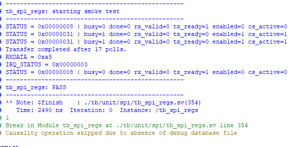
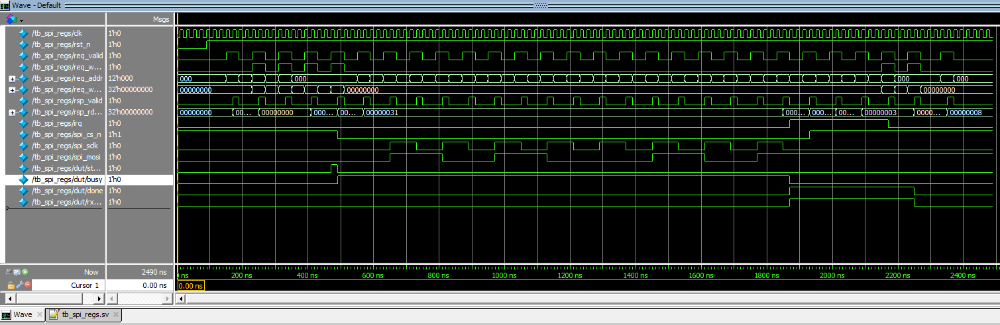

# ENG NOTEBOOK - SPI

## Status
SPI is the next active peripheral workstream.

## Goal
Integrate an SPI peripheral into the modular control system using the project’s standard peripheral structure:
- vendor/core isolation
- local register file
- AXI4-Lite wrapper
- top-level subsystem integration

## Design Decision
Instead of writing the SPI protocol engine from scratch, this project uses an existing open-source Verilog SPI core as the low-level shift/timing engine.

Reasoning:
- reduces time spent re-deriving standard SPI timing logic
- allows focus on SoC integration and software-visible interface design
- keeps the reusable architecture of this repository consistent

## Third-Party Core Strategy
Vendor RTL is isolated under:
`rtl/peripherals/spi/vendor/opencores_verilog_spi/trunk/`

Project-owned integration logic remains separate:
- `rtl/peripherals/spi/axi_lite_spi.sv`
- `rtl/peripherals/spi/regs/spi_regs.sv`

This separation is intentional to:
- preserve attribution and licensing clarity
- avoid mixing vendor code with project code
- make future core replacement easier

## Planned Integration Layers
1. SPI vendor core
2. SPI register file
3. AXI4-Lite wrapper
4. System/top-level integration
5. Software test through Nios V

## Initial Tasks
- review vendor SPI handshake and timing assumptions
- define software-visible register map
- connect register layer to vendor core
- add status and interrupt strategy
- create basic smoke test

## Notes
The first objective is functional bring-up, not feature completeness.
Advanced items such as FIFOs, interrupts, and extended transaction support can be added after baseline integration works.

## April 4, 2026
Finished implementing the MMIO wrapper for the SPI module, it implemented the following memory mapped registers
```text
//Register map (32-bit words):
//  0x00    CTRL
//          bit 0   ENABLE          WR      Turn SPI module on
//          bit 1   START           W1P     Start transaction
//          bit 2   XFER_END        WR      Default:1 > Realease CS after transfer; 0 > CS stays low
//          bit 3   CLR_DONE        W1P     Clears the DONE flag from STATUS register
//          bit 4   CLR_RX_VALID    W1P     Clears the RX_VALID flag from  STATUS register
//
//  0X04    STATUS
//          bit 0   BUSY            RO      Transactions is in progress
//          bit 1   DONE            RO      Transaction has finished    (sticky)
//          bit 2   RX_VALID        RO      Data received is valide     (sticky)
//          bit 3   TX_READY        RO      SPI module can send another word
//          bit 4   ENABLED         RO      SPI module is on (enabled)
//          bit 5   CS_ACTIVE       RO      CS is asserted
//
//  0x08    TXDATA
//          bits[7:0] TX byte       WO
//
//  0x0C    RXDATA
//          bits[7:0] RX byte       RO
//
//  0x10    IRQ_EN
//          bit 0   DONE_IE         RW      interrupt enable for transfer done
//          bit 1   RX_VALID_IE     RW      interrupt enable for RX valid
//
//  0x14    IRQ_STATUS
//          bit 0   DONE_IP         RO/W1C  interrupt   pending for done
//          bit 1   RX_VALID_IP     RO/W1C  interrupt pending for rx valid
//
```

I decided to add interrupt capability so I don't have the NIOS V (or any other processor) polling and wasting processor cycles. 

The test bench has been generated with assistance from ChatGPT to speed up testing

## PowerShell commands to run the testbench
```powershell
New-Item -ItemType Directory -Force build\sim\work | Out-Null
New-Item -ItemType Directory -Force build\sim\logs | Out-Null
New-Item -ItemType Directory -Force build\sim\waves | Out-Null

vlib build\sim\work

vlog -work build\sim\work -sv `
    .\rtl\peripherals\spi\vendor\opencores_verilog_spi\trunk\clk_valid.v `
    .\rtl\peripherals\spi\vendor\opencores_verilog_spi\trunk\spi_master.v `
    .\rtl\peripherals\spi\regs\spi_regs.sv `
    .\tb\unit\spi\tb_spi_regs.sv

vsim -c -work build/sim/work tb_spi_regs -l build/sim/logs/tb_spi_regs.log -wlf build/sim/waves/tb_spi_regs.wlf -do "run -all; quit"
```

After all the test passed, I decided to take a look at the waveforms by running the following command to open the GUI:
```powershell
vsim -voptargs=+acc -work build/sim/work tb_spi_regs -wlf build/sim/waves/tb_spi_regs.wlf
```
and then, inside the GUI ran the following commands:
```tcl
add wave sim:/tb_spi_regs/clk
add wave sim:/tb_spi_regs/rst_n
add wave sim:/tb_spi_regs/req_valid
add wave sim:/tb_spi_regs/req_write
add wave sim:/tb_spi_regs/req_addr
add wave sim:/tb_spi_regs/req_wdata
add wave sim:/tb_spi_regs/rsp_valid
add wave sim:/tb_spi_regs/rsp_rdata
add wave sim:/tb_spi_regs/irq
add wave sim:/tb_spi_regs/spi_cs_n
add wave sim:/tb_spi_regs/spi_sclk
add wave sim:/tb_spi_regs/spi_mosi
add wave sim:/tb_spi_regs/dut/start_fire
add wave sim:/tb_spi_regs/dut/busy
add wave sim:/tb_spi_regs/dut/done
add wave sim:/tb_spi_regs/dut/rx_valid
run -all
```

## SPI Transfer Waveform

### SPI Register Block – Simulation Results (tb_spi_regs)



**Summary:**  
The SPI register subsystem successfully completed a full transaction using the MMIO interface, including control, data transfer, status reporting, and interrupt signaling.

---

### Execution Breakdown

- **Initial State**
  - `enabled=0`, `busy=0`, `tx_ready=1`
  - Peripheral is idle and ready for configuration

- **Transfer Initiation**
  - CPU writes `TXDATA = 0xA5`
  - CPU sets `ENABLE=1` and issues `START`
  - `CS` asserted (`cs_active=1`)
  - `busy=1` confirms transfer in progress

- **During Transfer**
  - `tx_ready=0` (core is busy)
  - `done=0`, `rx_valid=0` (no premature completion flags)

- **Completion**
  - Transfer completes after ~17 polling cycles
  - `done=1`, `rx_valid=1` asserted
  - Confirms proper end-of-transfer detection

- **Data Path Verification**
  - `RXDATA = 0xA5`
  - Matches transmitted value via loopback (`MOSI → MISO`)
  - Confirms correct SPI shift and capture behavior

- **Interrupt Behavior**
  - `IRQ_STATUS = 0x3`
    - `DONE_IP = 1`
    - `RX_VALID_IP = 1`
  - Interrupt asserted only when enabled and pending
  - Confirms correct IRQ gating and sticky pending logic

- **Clear Operations (W1C / W1P)**
  - Writing to `IRQ_STATUS` clears pending bits
  - Writing to CTRL with `CLR_DONE` and `CLR_RX_VALID` clears sticky flags
  - Final STATUS returns to:
    - `busy=0`, `done=0`, `rx_valid=0`, `enabled=0`

---

### Key Design Validations

- MMIO interface correctly handles read/write transactions
- Control logic safely gates configuration changes during active transfer
- TXDATA is decoupled from active transfer (no corruption mid-transaction)
- Sticky status flags (`DONE`, `RX_VALID`) behave as intended
- Interrupt system correctly separates:
  - enable (`IRQ_EN`)
  - pending (`IRQ_STATUS`)
- Level-sensitive IRQ prevents missed events

---

### Notes

- Simulation uses loopback configuration (`spi_mosi → spi_miso`)
- Transfer length = 8 bits (default SPI_DW)
- Polling-based completion used for simplicity (interrupt-driven flow also verified)

---

### Conclusion

The SPI peripheral is functionally verified at the register-transfer level and is ready for:
- AXI4-Lite integration
- Platform Designer system integration
- Nios V software-driven testing

### SPI Transfer Waveform (tb_spi_regs)



**Figure:** Single SPI transaction showing MMIO write → START → shift → DONE → idle.

---

### Transaction Walkthrough

1. **MMIO Write Phase**
   - `req_valid` pulses indicate register writes from the testbench
   - `req_addr` and `req_wdata` configure:
     - TXDATA = `0xA5`
     - CTRL (ENABLE + START)
   - Corresponding `rsp_valid` confirms successful register access

2. **Transfer Start**
   - `start_fire` pulses high (internal event)
   - `busy` transitions from `0 → 1`
   - `spi_cs_n` goes low → SPI device selected

3. **Clocking / Data Shift**
   - `spi_sclk` produces **8 clock pulses** (SPI_DW = 8)
   - `spi_mosi` shifts out `0xA5` (MSB-first)
   - `spi_cs_n` remains low for entire transfer window
   - `busy` stays high during active shifting

4. **Transfer Completion**
   - After final clock:
     - `busy` deasserts (`1 → 0`)
     - `done` asserts (sticky flag)
     - `rx_valid` asserts (data ready)

5. **Post-Transfer State**
   - `spi_cs_n` returns high → transaction ends
   - System returns to idle
   - `done` and `rx_valid` remain asserted until cleared by software

---

### Key Timing Observations

- `spi_cs_n` cleanly bounds the transaction
- `spi_sclk` activity is strictly contained within `busy=1`
- No premature assertion of `done` or `rx_valid`
- `busy` accurately tracks the active transfer window
- Exactly **8 SCLK cycles** confirm correct data width configuration

---

### Data Integrity

- Transmitted data: `0xA5`
- Loopback path (`MOSI → MISO`) ensures received data matches transmitted data
- Confirms correct:
  - bit ordering (MSB-first)
  - shift timing
  - sampling alignment

---

### Design Validation

This waveform verifies:

- Correct MMIO → hardware interaction
- Proper synchronization between control and datapath
- Deterministic transaction boundaries
- Clean separation of:
  - control (`start_fire`)
  - execution (`busy`, `spi_sclk`)
  - completion (`done`, `rx_valid`)

---

### Conclusion

The SPI subsystem demonstrates correct functional behavior at the signal level, validating both control logic and serial data transfer timing. The design is ready for system-level integration.

## UPDATE
## April 6, 2026

### Testbench refinement and simulation findings

Today I refined the SPI register-block verification flow and simplified the testbench strategy.

The original SPI register testbench became more complicated than needed for early bring-up because it tried to exercise many configurations in one run and used a more complex SPI slave model. For learning and bring-up, I replaced it with a simpler testbench that focuses on software-visible behavior and uses a loopback connection:

```text
spi_mosi -> spi_miso
```

This simpler approach makes it easier to validate:
- register reads and writes
- START behavior
- BUSY behavior
- XFER_OPEN behavior
- sticky DONE and RX_VALID flags
- IRQ pending behavior
- single-byte and multi-byte transfers

The simplified testbench now covers:
1. reset defaults
2. single-byte transfer
3. two-byte transfer
4. four-byte transfer
5. CTRL writes while `busy == 1`
6. CTRL writes while `xfer_open == 1`

---

### Board-aligned simulation clock

Since this project targets the DE10-Lite board, I updated the testbench clock to model a **50 MHz** system clock instead of 100 MHz.

That means the testbench clock is now:

```systemverilog
forever #10 clk = ~clk;
```

which corresponds to a 20 ns period.

This does not change the SPI functional contract by itself, but it keeps the simulation setup more aligned with the real board-level environment.

---

### Important design finding: launch-time XFER_END handling

A key issue was found during multi-byte verification.

When software wrote `START=1` and `XFER_END=1` in the same MMIO write, the wrapper originally used the **previous stored value** of `ctrl_xfer_end` when deciding whether the launched byte was the final byte. As a result, the supposed final byte could still be treated as non-final.

This caused symptoms such as:
- `DONE` not asserting on the last byte
- `XFER_OPEN` staying high after the final byte
- final-byte tests failing even though shifting activity occurred

The fix was to derive a launch-time effective qualifier for the current CTRL write and use that for both:
- the value sent to the vendor core
- the value latched into `launched_xfer_end`

This made final-byte behavior deterministic and aligned the wrapper’s internal bookkeeping with the actual launched byte.

---

### Important design finding: START pulse can be missed in open multi-byte transactions

Additional testing across SPI modes showed a second issue.

In the current wrapper architecture, `START` is still treated as a one-cycle software request pulse. During an open multi-byte transaction, the vendor core may only be ready during a narrow `core_wready` window. If software writes `START` outside that window, the request is lost.

Observed symptom:
- first byte launches correctly
- transaction remains open
- later bytes are staged in `TXDATA`
- but the later `START` pulses are missed
- `xfer_open` remains high because the final byte never actually launches

This is an important software-interface finding.

#### Design implication
The wrapper should eventually latch a **pending START request** so that software does not need to hit a narrow ready window exactly.

Planned improvement:
- add `start_pending`
- capture the software START request
- hold it until the vendor core is actually ready
- clear it once `tx_fire` occurs

This would make the MMIO/software contract much more robust for multi-byte transfers.

At the time of this note, this is considered the next RTL improvement for the SPI wrapper.

---

### Testbench strategy decision

For now, the recommended verification strategy is:

- keep the testbench **simple**
- verify one SPI configuration at a time
- change parameters and rerun rather than building a very large all-configurations-at-once testbench

This is easier to debug and better aligned with learning goals.

Recommended parameter sweep:
- `CPOL=0, CPHA=0`
- `CPOL=0, CPHA=1`
- `CPOL=1, CPHA=0`
- `CPOL=1, CPHA=1`
- `BITORDER="LSB_FIRST"`
- `CLKDIV=8`

---

### Current verification status

#### Verified
- reset defaults
- single-byte transfer behavior
- basic multi-byte transaction state behavior
- launch-time `XFER_END` fix
- sticky `DONE` / `RX_VALID`
- IRQ pending behavior
- waveform inspection in Questa GUI

#### Open item
- make multi-byte START handling robust across all SPI modes by latching a pending START request instead of relying on a one-cycle software pulse to align with `core_wready`

---

### Updated interpretation of status bits

The SPI register file now uses the following conceptual split:

- `BUSY`
  - means a byte is currently in flight
  - software should not expect a new byte to launch while this is high

- `XFER_OPEN`
  - means a transaction is still open
  - this can remain high between bytes during a multi-byte transfer even when `BUSY=0`

This distinction is important for software and for testbench checks.

---

### Updated Questa simulation flow

The corrected and reliable Questa flow uses a mapped `work` library.

#### Compile
```powershell
New-Item -ItemType Directory -Force build\sim | Out-Null
New-Item -ItemType Directory -Force build\sim\logs | Out-Null
New-Item -ItemType Directory -Force build\sim\waves | Out-Null

vlib build\sim\work
vmap work build\sim\work

vlog -work work -sv .\rtl\peripherals\spi\vendor\opencores_verilog_spi\trunk\clk_valid.v .\rtl\peripherals\spi\vendor\opencores_verilog_spi\trunk\spi_master.v .\rtl\peripherals\spi\regs\spi_regs.sv .\tb\unit\spi\tb_spi_regs.sv
```

#### Console run
```powershell
vsim -c work.tb_spi_regs -do "run -all; quit"
```

#### Console run with log + waveform file
```powershell
vsim -c work.tb_spi_regs -l build\sim\logs\tb_spi_regs.log -wlf build\sim\waves\tb_spi_regs.wlf -do "run -all; quit"
```

#### GUI run
```powershell
vsim work.tb_spi_regs -voptargs=+acc -wlf build\sim\waves\tb_spi_regs.wlf
```

---

### Updated waveform viewing note

To view DUT-centric signals in the GUI, `+acc` was required because optimized simulation hid many signals from the wave viewer.

A useful reduced signal set is:
- `dut/ctrl_enable`
- `dut/ctrl_xfer_end`
- `dut/busy`
- `dut/done`
- `dut/rx_valid`
- `dut/xfer_open`
- `dut/launched_xfer_end`
- `dut/txdata_reg`
- `dut/rxdata_reg`
- `dut/core_wready`
- `dut/core_transfer_end`
- `dut/core_rvalid`
- `dut/core_rdata`
- `dut/spi_cs_n`
- `dut/spi_sclk`
- `dut/spi_mosi`
- `dut/spi_miso`

This reduced set was easier to reason about than mixing many duplicated top-level and DUT-internal signals.

---

### Suggested update to the earlier conclusion

The earlier conclusion can be updated to better reflect the current status of the work.

Suggested replacement:

> The SPI peripheral has passed initial RTL-level verification for baseline register and transfer behavior. Additional refinement is still in progress for robust multi-byte START handling across all SPI modes before broader system integration.


## SPI Regression Summary — April 6, 2026

A simplified loopback-based SPI register-block testbench was used to verify the SPI MMIO wrapper behavior across multiple operating modes.

### Testbench scope
The regression covered:
- reset defaults
- single-byte transfer
- two-byte transfer
- four-byte transfer
- CTRL writes while `busy == 1`
- CTRL writes while `xfer_open == 1`
- sticky `DONE` / `RX_VALID`
- IRQ pending behavior
- loopback data verification (`spi_mosi -> spi_miso`)

### Configurations exercised
The following SPI configurations were simulated successfully:

- **Mode 0**  
  `CPOL=0, CPHA=0, BITORDER=MSB_FIRST, CLKDIV=8`

- **Mode 1**  
  `CPOL=0, CPHA=1, BITORDER=MSB_FIRST, CLKDIV=8`

- **Mode 2**  
  `CPOL=1, CPHA=0, BITORDER=MSB_FIRST, CLKDIV=8`

- **Mode 3**  
  `CPOL=1, CPHA=1, BITORDER=MSB_FIRST, CLKDIV=4`

- **Mode 3**  
  `CPOL=1, CPHA=1, BITORDER=LSB_FIRST, CLKDIV=8`

### Key findings
- Reset behavior is correct.
- Single-byte transfers complete correctly.
- Two-byte and four-byte transactions correctly maintain and clear `xfer_open`.
- `DONE` asserts only on the final byte of a transaction.
- `RX_VALID` asserts on each completed byte.
- CTRL protection works as intended:
  - `ENABLE` writes are blocked while `xfer_open == 1`
  - `XFER_END` can be updated for the next launched byte
- IRQ pending bits behave correctly for per-byte and final-byte events.
- Loopback data matched transmitted data in all passing test configurations.

### Design improvements validated
The regression validated two important RTL fixes:
1. **Launch-time XFER_END handling**
   - final-byte behavior now uses the correct launch-time qualifier
   - prevents final bytes from being misclassified as non-final

2. **More robust multi-byte launch behavior**
   - open-transaction behavior is now much more stable across SPI modes
   - multibyte sequencing works correctly in the tested configurations

### Conclusion
The SPI register layer now demonstrates correct baseline behavior across the tested SPI modes, bit-order configurations, and multibyte transaction lengths. The peripheral is in a much stronger state for continued integration work, including AXI4-Lite system integration and eventual processor-driven testing.

## Engineering Notebook Entry — 2026-04-08
### Topic: DE10-Lite ADXL345 SPI bring-up and interface-mode debug

**Objective**  
Verify real communication between the Nios V SPI peripheral and the on-board ADXL345 accelerometer on the DE10-Lite, and determine why an initial `DEVID` read was returning `0xFF` instead of `0xE5`.

---

### Background
The SPI peripheral is integrated in the Nios V system and connected at the top level as:

- `spi_master_sclk -> GSENSOR_SCLK`
- `spi_master_mosi -> GSENSOR_SDI`
- `spi_master_miso <- GSENSOR_SDO`
- `spi_master_cs_n -> GSENSOR_CS_N`

The hardware path is therefore a **4-wire-style SPI hookup**.

Initial software testing showed:
- SPI status behavior looked valid
- transactions opened and closed correctly
- received data was `0xFF`

This suggested the issue was not a simple MMIO/software sequencing bug, but something related to the ADXL345 interface mode or board-facing SPI behavior.

---

### Procedure

#### 1. Verified SPI register/software contract
Reviewed `spi_regs.sv` and confirmed:

- `CTRL[0]` = `ENABLE`
- `CTRL[1]` = `START`
- `CTRL[2]` = `XFER_END`
- `CTRL[3]` = `CLR_DONE`
- `CTRL[4]` = `CLR_RX_VALID`

And:

- `STATUS[0]` = `BUSY`
- `STATUS[1]` = `DONE`
- `STATUS[2]` = `RX_VALID`
- `STATUS[3]` = `TX_READY`
- `STATUS[5]` = `CS_ACTIVE`
- `STATUS[6]` = `XFER_OPEN`

This established that the peripheral expects **one START per byte**, with `XFER_END` applying to the **next launched byte**.

---

#### 2. Simplified software to a minimal SPI smoke test
Created a very simple `main.c` that:

- enabled the SPI block
- loaded TX bytes directly
- launched one byte at a time
- polled `STATUS`
- read `RXDATA`
- repeated slowly for debug visibility

The first version only attempted a raw `DEVID` read:

- byte 0 = `0x80`
- byte 1 = `0x00`

Observed result:
- `DEVID = 0xFF`
- status values indicated the internal SPI transaction framing was valid

Conclusion at this point:
- software contract and transaction framing looked correct
- issue likely existed at the external sensor interface level

---

#### 3. Checked CS polarity and top-level mapping
Reviewed source files and confirmed:

- no inversion of `spi_cs_n` in `spi_regs.sv`
- no inversion in `axi_lite_spi.sv`
- no inversion in `modular_control_system_top.sv`

Top-level directly connects:

- `spi_master_cs_n (GSENSOR_CS_N)`

Conclusion:
- CS polarity is consistent end-to-end
- no evidence of a double inversion bug

---

#### 4. Verified DE10-Lite accelerometer pin assignments
Checked Quartus assignments and confirmed they match the DE10-Lite accelerometer signals:

- `GSENSOR_CS_N`
- `GSENSOR_SCLK`
- `GSENSOR_SDI`
- `GSENSOR_SDO`
- `GSENSOR_INT[1]`
- `GSENSOR_INT[2]`

Directions were also consistent with the top-level module:
- CS, SCLK, SDI as outputs
- SDO as input

Conclusion:
- no obvious direction or pin-name mismatch

---

#### 5. Reviewed Terasic DE10-Lite G-sensor demonstration RTL
Examined the DE10-Lite demonstration files:

- `DE10_LITE_GSensor.v`
- `spi_controller.v`
- `spi_ee_config.v`
- `spi_param.h`

Key discovery:
- the Terasic demo uses **3-wire SPI**
- the demo uses a **single bidirectional SDIO line**
- the demo writes `DATA_FORMAT = 0x40`, which selects 3-wire SPI mode on the ADXL345

This was a major clue because my design is wired as a **4-wire-style interface** using separate MOSI and MISO.

Conclusion:
- my previous test was ambiguous because software did not explicitly set the ADXL345 interface mode

---

#### 6. Updated software to explicitly force 4-wire mode
Modified `main.c` to remove ambiguity:

1. write `DATA_FORMAT = 0x00`
2. read back `DATA_FORMAT`
3. read `DEVID`

This ensures the ADXL345 is explicitly configured for **4-wire SPI**, matching the current hardware hookup.

---

### Results

Observed console output:

- `READ DATA_FORMAT = 0x00 <-- 4-wire confirmed`
- `READ DEVID = 0xE5 <-- PASS`

Repeated passes were consistent.

Interpretation:
- the ADXL345 responded correctly once software explicitly selected 4-wire mode
- SPI communication is working
- top-level mapping and pin assignments are correct
- the Nios V SPI peripheral and MMIO wrapper are functioning as intended

---

### Findings

1. The SPI peripheral and register interface were **not** the root problem.
2. CS polarity and top-level wiring were correct.
3. Quartus signal directions and pin assignments were correct.
4. The Terasic reference design uses **3-wire SPI**, which initially created confusion during bring-up.
5. My hardware/software path is working in **4-wire mode** when the software explicitly writes:
   - `DATA_FORMAT = 0x00`
6. The ADXL345 `DEVID` register was successfully read as:
   - `0xE5`

---

### Root Cause
The earlier failing `DEVID` read was caused by **interface-mode ambiguity**.

The custom design assumed a 4-wire-style SPI hookup, but the ADXL345 interface mode was not being explicitly set in software. Once `DATA_FORMAT` was explicitly written to `0x00`, communication succeeded.

---

### Final Status
**PASS**

Successful verification of:
- explicit 4-wire ADXL345 configuration
- readback of `DATA_FORMAT = 0x00`
- successful `DEVID = 0xE5` read

---

### Notes for Future Work

- Keep the explicit `DATA_FORMAT = 0x00` write in bring-up code to avoid ambiguity.
- Use this smoke test as the known-good baseline before adding axis reads.
- Next logical test:
  - read `X_LB/X_HB`
  - read `Y_LB/Y_HB`
  - read `Z_LB/Z_HB`
- Consider documenting clearly in the repo/notebook:
  - **Terasic demo uses 3-wire**
  - **current custom Nios V design uses explicit 4-wire**

---

### Short Summary
Today’s testing confirmed that the DE10-Lite on-board ADXL345 can be read successfully through the custom Nios V SPI peripheral once the device is explicitly forced into **4-wire SPI mode** by writing `DATA_FORMAT = 0x00`. After that change, repeated reads returned `DEVID = 0xE5`, confirming correct communication.
